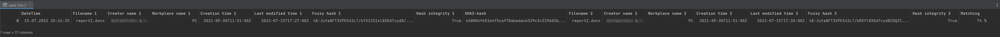

# Fuzzy Docmarking Tool
Tool for marking and identifying documents based on fuzzy hashing for tracking by a DLP-system.

```
usage: python3 -m src.main [-h] [-i INJECT [INJECT ...]] [-o OUTPUT] [-r]
               [-c COMPARE [COMPARE ...]] [-wr WRITE_RESULTS]

optional arguments:
  -h, --help            show this help message and exit
  -i INJECT [INJECT ...], --inject INJECT [INJECT ...]
                        Inject identifier in document(s). If the passed path
                        is a directory, the identifier will be injected in all
                        files with the desired extension.
  -o OUTPUT, --output OUTPUT
                        Destination folder for saving injected document(s).
  -r, --recursive       Collects file for injection in folder recursively.
  -c COMPARE [COMPARE ...], --compare COMPARE [COMPARE ...]
                        Compare first file with the next passed file(s) by
                        their identifiers.
  -wr WRITE_RESULTS, --write_results WRITE_RESULTS
                        Writing compare results to passed .csv file.
```

### Инжектирование идентификаторов в файлы:
```shell
$ python3 -m src.main -i report1.docx report2.docx -o .\out\
Processing...
Identifier was injected successfully in file report1.docx and moved in out directory B:\github\fuzzy_docmarking_checker\out
Identifier was injected successfully in file report2.docx and moved in out directory B:\github\fuzzy_docmarking_checker\out
Injection completed
```

### Сравнение файлов на основе атрибутов и нечёткого хеша
```shell
$ python3 -m src.main -c ".\out\report1.docx" ".\out\report2.docx" -wr ./result.csv
+--------------------+--------------------------------------------------------------------------------------------+---------------------------------------------------------------------------------------------+----------+
|      Filename      |                                        report1.docx                                        |                                         report2.docx                                        |   [ ]    |
|    Creator name    |                                      xxxxBoyxxxx X.Y.                                      |                                       xxxxBoyxxxx X.Y.                                      |   [v]    |
|   Workplace name   |                                             PC                                             |                                              PC                                             |   [v]    |
|   Creation time    |                                    2021-05-30T11:51:00Z                                    |                                     2021-05-30T11:51:00Z                                    |   [v]    |
| Last modified time |                                    2022-07-15T17:27:00Z                                    |                                     2022-07-15T17:30:00Z                                    |   [ ]    |
|     Fuzzy hash     | 48:Juta8FT3VPES42LT/kYSI2SIxl8XDdTcyd8/KQ3l8XDdTcu5HMHIHMRAosPUIxl4:JAy6o5AG/iGuI7s6GdiGuR | 48:Juta8FT3VPES42LT/kM3Yl8XDdTcyd8CDQ3l8XDdTcuGJHMHIHM8es7l8XDdTcMW:JAy6oIxGLiGu7AesuGhiGu8 |   74 %   |
|   Hash integrity   |                                            True                                            |                                             True                                            |   [v]    |
+--------------------+--------------------------------------------------------------------------------------------+---------------------------------------------------------------------------------------------+----------+
```

Флаг `-wr (--write_result)` выводит результаты вычислений в .csv файл.


`Copyright 2022 aaaaaaaalesha`